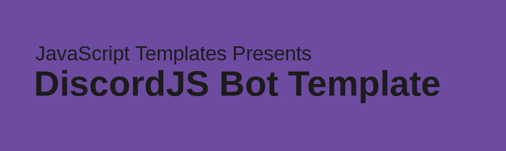

# discordjs-bot
discordjs-bot Template

## Config + Env Setup

1. Open `example.env` and enter your TOKEN in the TOKEN slot.
2. Rename `example.env` to `.env`.
3. Open `example.config.json` and enter your Discord ID, along with a prefix for your bot.
4. Rename `example.config.json` to `config.json`.

## Bot Setup

1. Create categories in `/commands` | e.g. `/commands/info` OR `/commands/music`
2. Add commands in the second directory | e.g. `/commands/info/ping.js` (Format for commands below)\

```js
// Specify packages here!
const Discord = require("discord.js");

module.exports = {
    name: "ping", // name of the file without .js
    aliases: ["ping", "pi"], //any aliases for the command
    category: "info", // the directory the file is in; directory after /commands/
    description: "Returns the bot ping time.", // description of the commands
    usage: "ping", // simple usage of the commands
    dev: false, // if its only meant for the owner/developer (Not working right now)
    run: async (client, message, args) => {// specify the code after this line

      let ping = new Discord.MessageEmbed()
        .setTitle('Ping')
        .setDescription(`🏓 Pong! Your ping is ${Math.round(client.ws.ping)}ms!`)
        .setColor(0x00AE86)
      
      message.channel.send(ping)
  
  } // end async function
} // end module.exports
```

# Resources

[Discord.js Docs](https://discord.js.org/)
[Discord.js Guide](https://discordjs.guide/)
